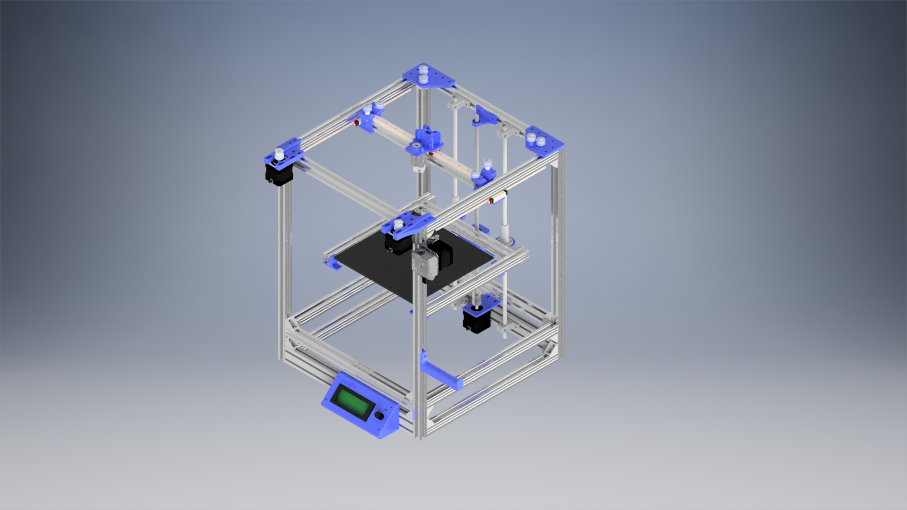

# CoreXY 3D printer
An open source 3D printer project

# Planning

#Current status

# Credits:

 -  **JuanCR**: [E3DV6 hotend](https://grabcad.com/library/e3dv6-hotend-1-75mm-1 "Grabcad E3DV6")
 -  **Ben Neubauer**: [E3D titan extruder](https://grabcad.com/library/e3d-titan-extruder-2 "Grabcad E3D titan extruder")
 -  **Lehaiver**: [NEMA 17](https://grabcad.com/library/nema-17-40mm-stepper-motor-1 "Grabcad nema 17")
 -  **Tom Edwards**: [Shaft coupler](https://grabcad.com/library/shaft-coupler-5-x-8-x-25mm-1 "Grabcad shaft coupler")
 -  **Jori Mäkinen**: [Linear guide mgn12](https://grabcad.com/library/linear-guide-mgn12-1 "Grabcad linear guide") 
 -  **Ryan**: [MGN 12h linear guide](https://grabcad.com/library/hiwin-mgn-12h-linear-guide-1 "Grabcad mgn 12h") 
 -  **Paulo Santos**: [GT2 pulley](https://grabcad.com/library/polia-gt2-20-dentes-com-rolamento-gt2-pulley-with-bearing-1 "Grabcad GT2 pulley") 
 -  **Motedis**: [2020 extrusion](http://www.motedis.nl/shop/table_cats.php?table_id=16 "Motedis 2020 extrusion")  

**Notice: This is a work in progress. Use at your own risk!**
