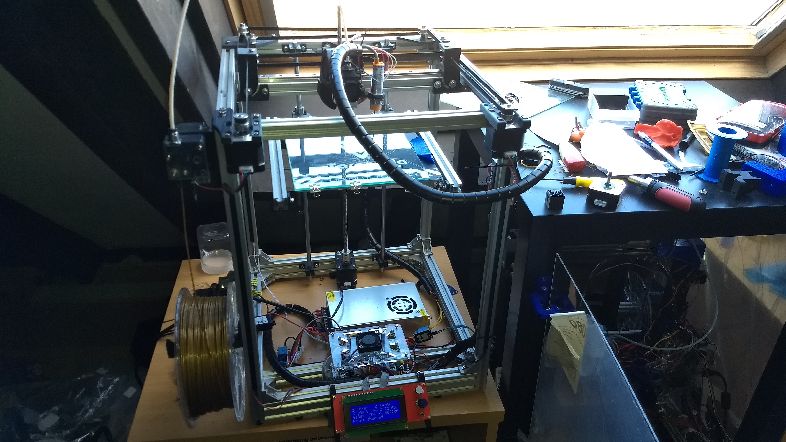
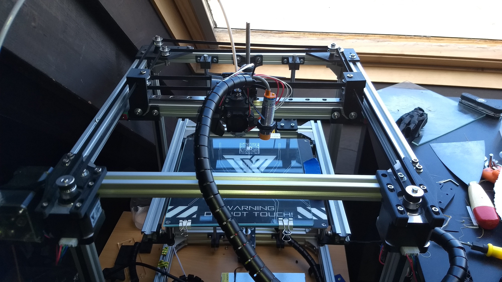
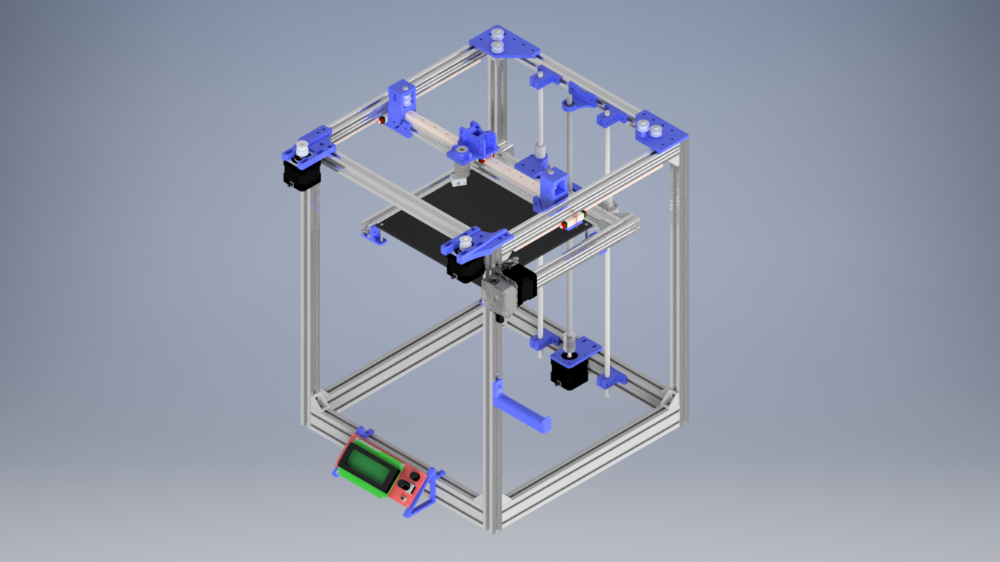
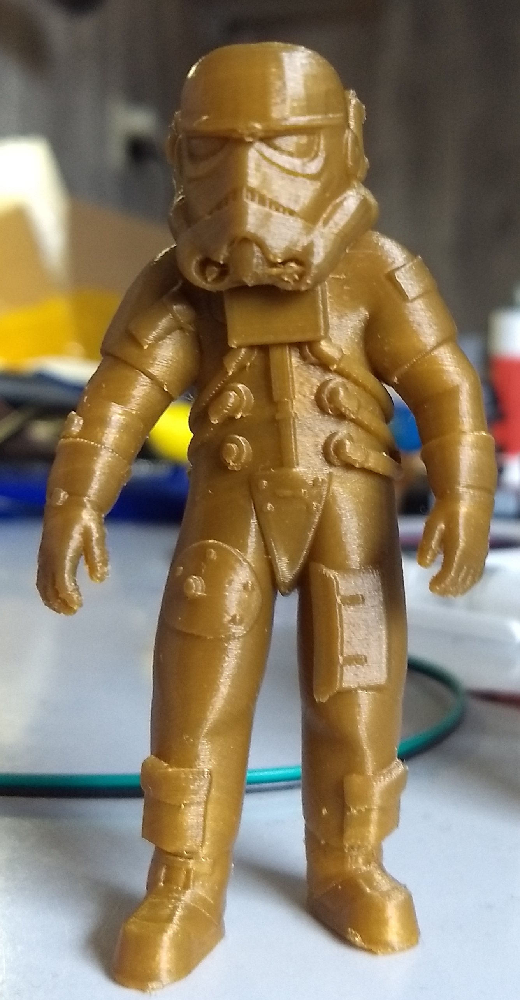

# Introduction

This repository will describe the process of designing and building an open
source 3D printer designed in Autodesk Inventor 2018. I am aware that Autodesk
Inventor is not open source, but when the first version is ready, I will put
STEP files in this repo so that everyone can edit the files.

**Some specs:**
 -  Print volume: 210x200x300 mm
 -  Frame size: 390x400x500 mm

# Planning

 -  ~~Design initial 3D design~~
 -  ~~Build the printer~~
 -  Test the printer
 -  Redesign parts and upgrade the printer
 -  Implement a Raspberry Pi
 -  Implement speech recognition, so that the printer can be controlled by voice

# Current status

The printer is put together and is producing already usable results (example
can be found [here](#printResult)). The next step is to redesign the x-carriage
because it is still not easy to attach the belts to it. Also, all the black belts
will be replaced with belts with metal in it to add more rigidity to the printer.

## Render of design:

##  Print results:

# Credits:

 -  **JuanCR**: [E3DV6 hotend](https://grabcad.com/library/e3dv6-hotend-1-75mm-1 "Grabcad E3DV6")
 -  **Ben Neubauer**: [E3D titan extruder](https://grabcad.com/library/e3d-titan-extruder-2 "Grabcad E3D titan extruder")
 -  **Lehaiver**: [NEMA 17](https://grabcad.com/library/nema-17-40mm-stepper-motor-1 "Grabcad nema 17")
 -  **Tom Edwards**: [Shaft coupler](https://grabcad.com/library/shaft-coupler-5-x-8-x-25mm-1 "Grabcad shaft coupler")
 -  **Jori Mäkinen**: [Linear guide mgn12](https://grabcad.com/library/linear-guide-mgn12-1 "Grabcad linear guide")
 -  **Ryan**: [MGN 12h linear guide](https://grabcad.com/library/hiwin-mgn-12h-linear-guide-1 "Grabcad mgn 12h")
 -  **Paulo Santos**: [GT2 pulley](https://grabcad.com/library/polia-gt2-20-dentes-com-rolamento-gt2-pulley-with-bearing-1 "Grabcad GT2 pulley")
 -  **Motedis**: [2020 extrusion](http://www.motedis.nl/shop/table_cats.php?table_id=16 "Motedis 2020 extrusion")  
 -  **Jacob**: [2004 LCD](https://grabcad.com/library/ramps-2004-lcd-prusa-reprap-screen-1-4-1 "Grabcad 2004 LCD")

**Notice: This is a work in progress. Use at your own risk!**
