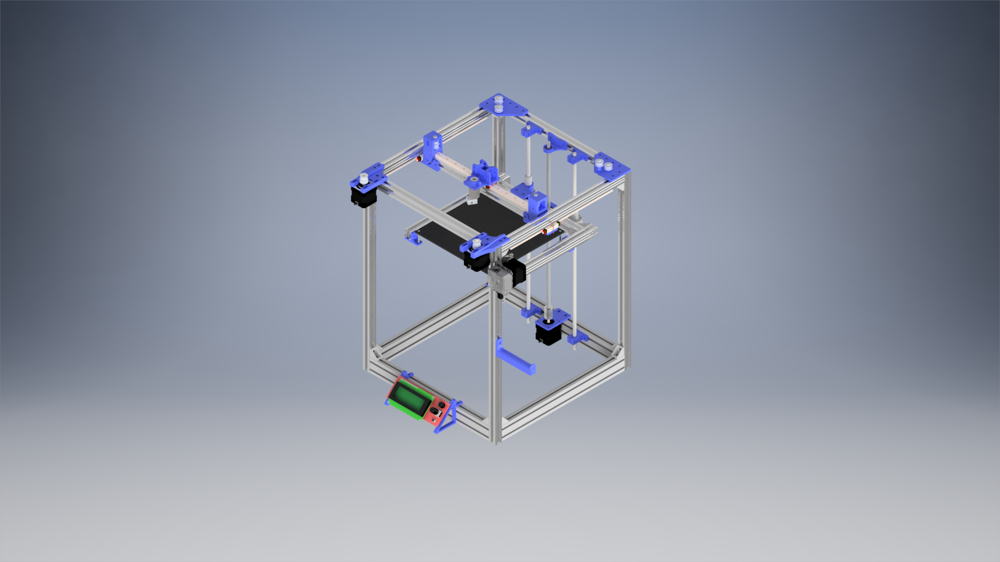

# Introduction

This repository will describe the process of designing and building an open source 3D printer made in Autodesk Inventor 2018. I am aware that Autodesk Inventor is not open source, but when the first version is ready, I will put STEP files in this repo so that everyone can edit the files.

**Some specs:**
 -  Print volume: 200x200x300 mm
 -  Frame size: 390x400x500 mm

# Planning

 -  Finish 3D design
 -  Gather all the required parts
 -  Build the printer
 -  Test the printer
 -  Optional: redesign parts and upgrade the printer
 -  Implement a Raspberry Pi
 -  Implement speech recognition, so that the printer can be controlled by voice

# Current status

Tested most of the 3D printed parts and updated their design. Still waiting for some parts to arrive.

# BOM (**not final**)

Mechanical:
 -  1x E3DV6 (clone)
 -  1x Tevo titan extruder
 -  2020 aluminium extrusion:
    *  4x 500 mm 
    *  4x 350 mm 
    *  6x 320 mm
    *  2x 290 mm
    *  1x 240 mm
 -  2040 aluminium extrusion:
    *  2x 350 mm
 -  1x PTFE tube 1m
 -  1x 430 mm leadscrew
 -  2x 500 mm chrome plated rod
 -  2x LMF8LUU
 -  8x GT2 Idler 20 Teeth Pulley 5 mm bore
 -  2x GT2 20 Teeth Pulley 5mm shaft
 -  1x GT2-6mm Belt 5 m
 -  50x M4 T-nut
 -  1x Borosilicate Glass Plate 213x200x3mm 

Electrical:
 -  4x NEMA17
 -  1x 12v Heat bed 220x220 mm
 -  1x MKS Base v1.4
 -  1x 12V 40w Cartridge heater 
 -  1x NTC 3950 100K ohm 
 -  4x Endstops
 -  1x 12 AWG 1 m RED
 -  1x 12 AWG 1 m BLACK
 -  1x Power supply 220v to 12v

# Credits:

 -  **JuanCR**: [E3DV6 hotend](https://grabcad.com/library/e3dv6-hotend-1-75mm-1 "Grabcad E3DV6")
 -  **Ben Neubauer**: [E3D titan extruder](https://grabcad.com/library/e3d-titan-extruder-2 "Grabcad E3D titan extruder")
 -  **Lehaiver**: [NEMA 17](https://grabcad.com/library/nema-17-40mm-stepper-motor-1 "Grabcad nema 17")
 -  **Tom Edwards**: [Shaft coupler](https://grabcad.com/library/shaft-coupler-5-x-8-x-25mm-1 "Grabcad shaft coupler")
 -  **Jori Mäkinen**: [Linear guide mgn12](https://grabcad.com/library/linear-guide-mgn12-1 "Grabcad linear guide") 
 -  **Ryan**: [MGN 12h linear guide](https://grabcad.com/library/hiwin-mgn-12h-linear-guide-1 "Grabcad mgn 12h") 
 -  **Paulo Santos**: [GT2 pulley](https://grabcad.com/library/polia-gt2-20-dentes-com-rolamento-gt2-pulley-with-bearing-1 "Grabcad GT2 pulley") 
 -  **Motedis**: [2020 extrusion](http://www.motedis.nl/shop/table_cats.php?table_id=16 "Motedis 2020 extrusion")  
 -  **Jacob**: [2004 LCD](https://grabcad.com/library/ramps-2004-lcd-prusa-reprap-screen-1-4-1 "Grabcad 2004 LCD")

**Notice: This is a work in progress. Use at your own risk!**